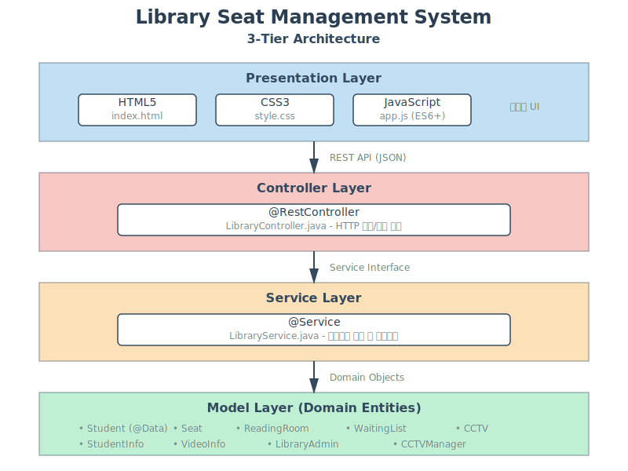

# 📚 Library Seat Management System

도서관 좌석 관리 및 CCTV 모니터링 시스템

## 📋 프로젝트 개요

이 프로젝트는 도서관의 좌석 예약, 대기열 관리, CCTV 모니터링을 통합한 종합 관리 시스템입니다. Spring Boot 기반의 백엔드 API와 반응형 웹 프론트엔드로 구성되어 있으며, Python Flask 대안도 제공합니다.

## ✨ 주요 기능

### 👤 학생 기능
- **좌석 신청**: QR 코드를 이용한 좌석 예약
- **좌석 취소**: 예약된 좌석 취소
- **대기열 관리**: 좌석이 없을 경우 자동 대기열 등록
- **실시간 좌석 현황**: 열람실별 좌석 상태 확인

### 👨‍💼 관리자 기능
- **CCTV 모니터링**: 실시간 열람실 영상 확인
- **좌석 현황 관리**: 전체 좌석 배치 및 상태 조회
- **학생 정보 관리**: 좌석 사용자 정보 확인

### 🎯 시스템 특징
- 열람실별 좌석 관리 (열람실 1: 60석, 열람실 2: 60석, 열람실 3: 80석)
- 자동 대기열 처리
- QR 코드 기반 출입 관리
- 반응형 웹 인터페이스

## 🏗️ 시스템 아키텍처



### 3-Tier Architecture

```
┌─────────────────────────────────────────────┐
│           Presentation Layer                │
│  (HTML5 + CSS3 + JavaScript)                │
│  - 좌석 현황 시각화                           │
│  - QR 스캔 인터페이스                          │
│  - 반응형 UI                                  │
└─────────────────┬───────────────────────────┘
                  │ REST API (JSON)
┌─────────────────▼───────────────────────────┐
│           Controller Layer                   │
│  (@RestController)                          │
│  - LibraryController                        │
│  - HTTP 요청/응답 처리                        │
│  - 입력 검증                                  │
└─────────────────┬───────────────────────────┘
                  │ Service Interface
┌─────────────────▼───────────────────────────┐
│           Service Layer                      │
│  (@Service)                                 │
│  - LibraryService                           │
│  - 비즈니스 로직                               │
│  - 트랜잭션 관리                               │
└─────────────────┬───────────────────────────┘
                  │ Domain Objects
┌─────────────────▼───────────────────────────┐
│           Model Layer                        │
│  (Domain Entities)                          │
│  - Student, Seat, ReadingRoom               │
│  - WaitingList, CCTV, VideoInfo             │
│  - StudentInfo, LibraryAdmin                │
└─────────────────────────────────────────────┘
```

### 핵심 컴포넌트

#### Backend (Spring Boot)
- **LibraryController**: REST API 엔드포인트 제공
- **LibraryService**: 비즈니스 로직 처리
- **Model Classes**: 도메인 엔티티 (Lombok 사용)

#### Frontend
- **index.html**: 메인 UI 구조
- **style.css**: 반응형 스타일링
- **app.js**: API 통신 및 동적 렌더링

#### Alternative Runtime
- **app.py**: Python Flask 구현 (Maven 없이 실행 가능)

## 🛠️ 기술 스택

### Backend
- **Java 11** (OpenJDK)
- **Spring Boot 2.7.18**
  - Spring Web (REST API)
  - Embedded Tomcat
- **Lombok** (코드 간소화)
- **Maven** (빌드 도구)

### Alternative Backend
- **Python 3.x**
- **Flask** (경량 웹 프레임워크)
- **Flask-CORS** (CORS 처리)

### Frontend
- **HTML5**
- **CSS3** (Grid, Flexbox)
- **Vanilla JavaScript** (ES6+)
- **Fetch API** (비동기 통신)

## 📦 프로젝트 구조

```
library_system/
├── src/
│   ├── main/
│   │   ├── java/com/library/
│   │   │   ├── LibraryApplication.java      # Spring Boot 메인
│   │   │   ├── controller/
│   │   │   │   └── LibraryController.java   # REST API
│   │   │   ├── service/
│   │   │   │   └── LibraryService.java      # 비즈니스 로직
│   │   │   └── model/
│   │   │       ├── Student.java
│   │   │       ├── StudentInfo.java
│   │   │       ├── Seat.java
│   │   │       ├── ReadingRoom.java
│   │   │       ├── WaitingList.java
│   │   │       ├── CCTV.java
│   │   │       ├── CCTVManager.java
│   │   │       ├── VideoInfo.java
│   │   │       ├── LibraryAdmin.java
│   │   │       └── SeatStatus.java
│   │   └── resources/
│   │       ├── application.properties        # Spring 설정
│   │       └── static/
│   │           ├── index.html               # 메인 페이지
│   │           ├── style.css                # 스타일시트
│   │           └── app.js                   # 프론트엔드 로직
│   └── test/
│       └── java/com/library/
├── app.py                                    # Flask 대안
├── pom.xml                                   # Maven 설정
├── README.md                                 # 프로젝트 문서
└── docs/
    └── architecture-diagram.png              # 아키텍처 다이어그램
```

## 🚀 설치 및 실행

### 사전 요구사항

#### Spring Boot 실행
- Java 11 이상
- Maven 3.6 이상

#### Flask 실행 (대안)
- Python 3.7 이상
- pip

### 1️⃣ Spring Boot로 실행

```powershell
# 저장소 클론
git clone <repository-url>
cd library_system

# Maven으로 빌드 및 실행
mvn clean install
mvn spring-boot:run
```

서버가 `http://localhost:8080`에서 실행됩니다.

### 2️⃣ Flask로 실행 (Maven 없이)

```powershell
# 저장소 클론
git clone <repository-url>
cd library_system

# 의존성 설치
pip install flask flask-cors

# 서버 실행
python app.py
```

서버가 `http://localhost:7000`에서 실행됩니다.

### 3️⃣ 웹 인터페이스 접속

브라우저에서:
- Spring Boot: `http://localhost:8080`
- Flask: `http://localhost:7000`

## 📡 API 문서

### GET /api/rooms
열람실 목록 및 좌석 현황 조회

**Response:**
```json
{
  "rooms": [
    {
      "roomNumber": 1,
      "seats": [
        {
          "seatNumber": 1,
          "status": "AVAILABLE",
          "student": null
        }
      ]
    }
  ]
}
```

### POST /api/apply
좌석 신청

**Request:**
```json
{
  "studentId": "2024001",
  "roomNumber": 1,
  "seatNumber": 5
}
```

**Response:**
```json
{
  "success": true,
  "message": "좌석 신청이 완료되었습니다."
}
```

### POST /api/cancel
좌석 취소

**Request:**
```json
{
  "studentId": "2024001"
}
```

**Response:**
```json
{
  "success": true,
  "message": "좌석이 취소되었습니다."
}
```

### POST /api/scan
QR 코드 스캔

**Request:**
```json
{
  "qrCode": "STUDENT_2024001"
}
```

**Response:**
```json
{
  "success": true,
  "message": "입실이 처리되었습니다.",
  "student": {
    "studentId": "2024001",
    "name": "홍길동"
  }
}
```

## 🔧 설정

### application.properties

```properties
# 서버 포트
server.port=8080

# 정적 리소스 경로
spring.web.resources.static-locations=classpath:/static/
```

### pom.xml 주요 의존성

```xml
<!-- Spring Boot Web -->
<dependency>
    <groupId>org.springframework.boot</groupId>
    <artifactId>spring-boot-starter-web</artifactId>
</dependency>

<!-- Lombok -->
<dependency>
    <groupId>org.projectlombok</groupId>
    <artifactId>lombok</artifactId>
    <optional>true</optional>
</dependency>
```

## 🎨 화면 구성

### 메인 화면
- **헤더**: 시스템 제목 및 QR 스캔 버튼
- **좌석 배치도**: 열람실별 좌석 그리드 표시
- **좌석 상태**: 
  - 🟢 초록색: 사용 가능
  - 🔴 빨간색: 사용 중
  - ⚫ 회색: 비활성

### QR 스캔 모달
- QR 코드 입력 인터페이스
- 실시간 스캔 결과 표시

## 🧪 테스트 데이터

시스템 시작 시 자동으로 테스트 데이터가 생성됩니다:
- 학생: 홍길동 (2024001), 김영희 (2024002), 이철수 (2024003)
- 열람실: 3개 (60석, 60석, 80석)
- CCTV: 각 열람실당 1대

## 🔐 보안 고려사항

- QR 코드 기반 인증
- 학생 ID 검증
- CORS 설정 (개발 환경)

## 📝 개발 가이드

### Lombok 사용

```java
@Data  // @Getter, @Setter, @ToString, @EqualsAndHashCode 자동 생성
public class Student {
    private String studentId;
    private String name;
}
```

### Service Layer 패턴

```java
@Service
public class LibraryService {
    @Autowired
    private LibraryManagementSystem system;
    
    public boolean applySeat(String studentId, int roomNumber, int seatNumber) {
        // 비즈니스 로직
    }
}
```

### Controller Layer

```java
@RestController
@RequestMapping("/api")
public class LibraryController {
    @Autowired
    private LibraryService service;
    
    @PostMapping("/apply")
    public Map<String, Object> applySeat(@RequestBody Map<String, Object> request) {
        // HTTP 처리
    }
}
```

## 🐛 문제 해결

### Maven이 설치되지 않은 경우
Python Flask 버전을 사용하세요:
```powershell
python app.py
```

### 포트 충돌
`application.properties`에서 포트 변경:
```properties
server.port=9090
```

### CORS 오류
개발 환경에서는 자동으로 처리됩니다. 프로덕션에서는 적절한 CORS 설정이 필요합니다.

## 📄 라이선스

이 프로젝트는 교육 목적으로 만들어졌습니다.

## 👥 기여자

- 프로젝트 설계 및 구현: TDD 기반 개발

## 📞 문의

프로젝트 관련 문의사항이 있으시면 Issue를 등록해주세요.

---

**Made with ❤️ for efficient library management**
